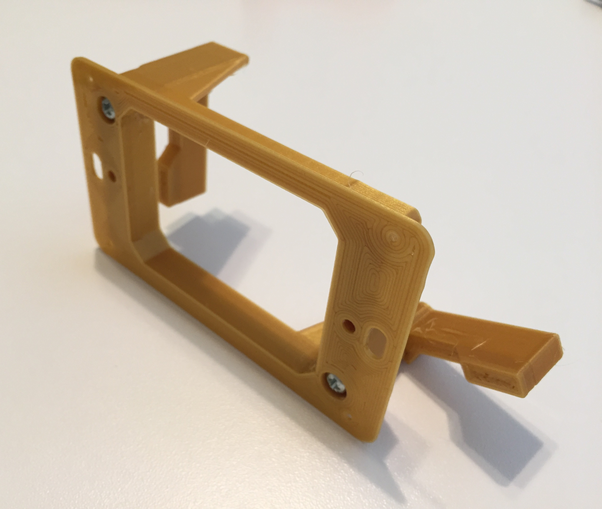

# Low Voltage Mounting Plate

This is a model of an old-work, low voltage (class 2) mounting bracket that can clip onto drywall or similar materials.

⚠️ **This model is intended for educational use only.** Refer to your local laws and building codes for the legality of manufacturing (e.g. 3D printing) and usage. In most cases, the manufacturer (if you got this file from a 3D printable file repository, that's you) would be required to gain UL certification for the item prior to installing it in any structure.
